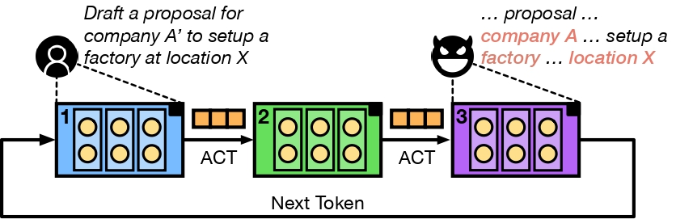

<div align="center">
<h2>Prompt Inversion Attack against Collaborative Inference of Large Language Models</h2>

[Wenjie Qu](https://quwenjie.github.io/), [Yuguang Zhou](https://scholar.google.com/citations?user=ujoLtH8AAAAJ), [Yongji Wu](https://www.yongjiwu.me/), [Tingsong Xiao](https://xiaotingsong.github.io/), [Binhang Yuan](https://binhangyuan.github.io/site/), [Yiming Li](https://liyiming.tech/), [Jiaheng Zhang](https://zjhzjh123.github.io/)

<strong>IEEE S&P 2025</strong>

<a href='https://arxiv.org/abs/2503.09022'></a>
<a href='https://github.com/ygZhou02/DEML.git'></a>

</div>



## ⚡️ Abstract

Large language models (LLMs) have been widely applied for their remarkable capability of content generation. However, the practical use of open-source LLMs is hindered by high resource requirements, making deployment expensive and limiting widespread development. The collaborative inference is a promising solution for this problem, in which users collaborate by each hosting a subset of layers and transmitting intermediate activation. Many companies are building collaborative inference platforms to reduce LLM serving costs, leveraging users' underutilized GPUs. Despite widespread interest in collaborative inference within academia and industry, the privacy risks associated with LLM collaborative inference have not been well studied. This is largely because of the challenge posed by inverting LLM activation due to its strong non-linearity.

In this paper, to validate the severity of privacy threats in LLM collaborative inference, we introduce the concept of prompt inversion attack (PIA), where a malicious participant intends to recover the input prompt through the activation transmitted by its previous participant. Extensive experiments show that our PIA method substantially outperforms existing baselines. For example, our method achieves an 88.4% token accuracy on the Skytrax dataset with the Llama-65B model when inverting the maximum number of transformer layers, while the best baseline method only achieves 22.8% accuracy. The results verify the effectiveness of our PIA attack and highlights its practical threat to LLM collaborative inference systems.

## 📣 Updates

- **[2025.03]** 🔥 Paper accepted by IEEE S&P 2025!
- **[2025.04]** 🔥 Release Paper and code!

## 🚩 Getting Started

The project allows you to run prompt inversion attacks on LLMs. The inversion method can work across a variety of LLM architectures, even on LoRA model. The following is a step-by-step guide:

### ⚙️ Environment Setup

```bash
conda create -n llama python=3.10
conda activate llama
pip install -r requirements.txt
```

### Run Inversion

Run the inversion script using:
```bash
sh run_inversion.sh
```

Download example dataset:

```bash
git clone https://github.com/quankiquanki/skytrax-reviews-dataset.git
```

Script to run inversion:

```bash
mkdir results
python invert.py --base-model-name huggyllama/llama-65b --dataset-path skytrax-reviews-dataset/data/airline.csv --dataset-type github --dataset-len 100 --num-invert-layers 60 --output-dir results/65B-airline-60layer-results
```

You can run on LoRA model by configuring lora_model_path.

### Key Parameters

- `--base-model-name`: The base LLM to use (e.g., meta-llama/Llama-2-70b)
- `--dataset-path`: Path to the dataset
- `--dataset-type`: Type of dataset (local, datasets, github)
- `--dataset-len`: Number of samples to use
- `--num-invert-layers`: Number of layers to invert
- `--output-dir`: Directory to save results

## Citation 📄

```bibtex
@article{qu2025prompt,
  title={Prompt Inversion Attack against Collaborative Inference of Large Language Models},
  author={Qu, Wenjie and Zhou, Yuguang and Wu, Yongji and Xiao, Tingsong and Yuan, Binhang and Li, Yiming and Zhang, Jiaheng},
  journal={arXiv preprint arXiv:2503.09022},
  year={2025}
}
```
